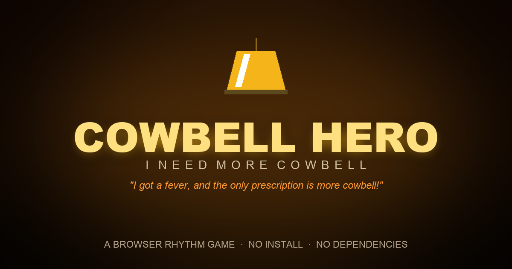

# Cowbell Hero

> "I got a fever, and the only prescription is more cowbell!"



A browser-based rhythm game where you ring the cowbell in time with classic rock
riffs. Notes stream down a neon highway toward the hit zone — nail the timing to
build combos, fill the fever meter, and rack up a high score.

## Play

Play it online: **https://lucanenni.github.io/cowbell-hero/**

No build step, no runtime dependencies. To run locally, serve the folder:

```bash
python3 -m http.server 8765
# then visit http://localhost:8765
```

Opening `index.html` directly via `file://` also works in most browsers, but a
local server is recommended so it reliably loads the files under `src/`.

### Controls

| Action | Key |
| --- | --- |
| Select a song | `↑` / `↓` (or hover) |
| Start / ring the cowbell | `Space` or `Enter` (or tap / click) |
| Pause / resume | `P` or `Esc` |

Reduced-motion preferences are honored: screen shake and particles are skipped
if the OS asks for less motion.

## Audio

The full backing track — drums, bass, guitar, and cowbell — is generated live
with the Web Audio API, so the game works completely offline.

> There is also an experimental YouTube mode that plays the real recordings, but
> the fixed-tempo charts drift against live performances, so it's hidden for now
> (`CONFIG.youtubeEnabled` in `src/config.js`).

## Songs

Every track is an original synth arrangement with a parody title and band — each
one riffs on a cowbell-famous rock classic, none of which it reproduces. Charts
aren't a flat loop either: every 8th bar gets a busier fill and later phrases
drop in a two-hit break, so the pattern breathes over the length of a song.

| Song | Band | BPM | Difficulty | Riffs on |
| --- | --- | --- | --- | --- |
| (Don't Fear) The Cowbell | Blue Öyster Cowbell | 75 | ★ | "(Don't Fear) The Reaper" — Blue Öyster Cult |
| Low Ringer | Moar | 100 | ★★ | "Low Rider" — War |
| Clonky Tonk Women | The Rolling Cowbells | 110 | ★★★ | "Honky Tonk Women" — The Rolling Stones |
| Mississippi Cowbell | Cowntain | 120 | ★★★★ | "Mississippi Queen" — Mountain |

## Project layout

```
index.html        markup and screen structure
src/config.js      tuning constants, songs, chart generation
src/audio.js       synth audio engine, YouTube player, music scheduler
src/render.js      canvas rendering: highway, notes, particles
src/game.js        game state, input, scoring, screen flow, main loop
```

Everything loads as plain `<script>` tags (no bundler, no modules), in that
order, so the four files share one global scope.

### Linting (dev only)

The game ships with zero runtime dependencies; `package.json` only pulls in
ESLint and html-validate for CI.

```bash
npm install
npm run lint
```

## License

[MIT](LICENSE)
